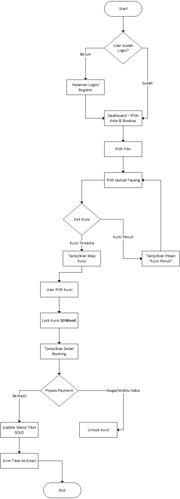
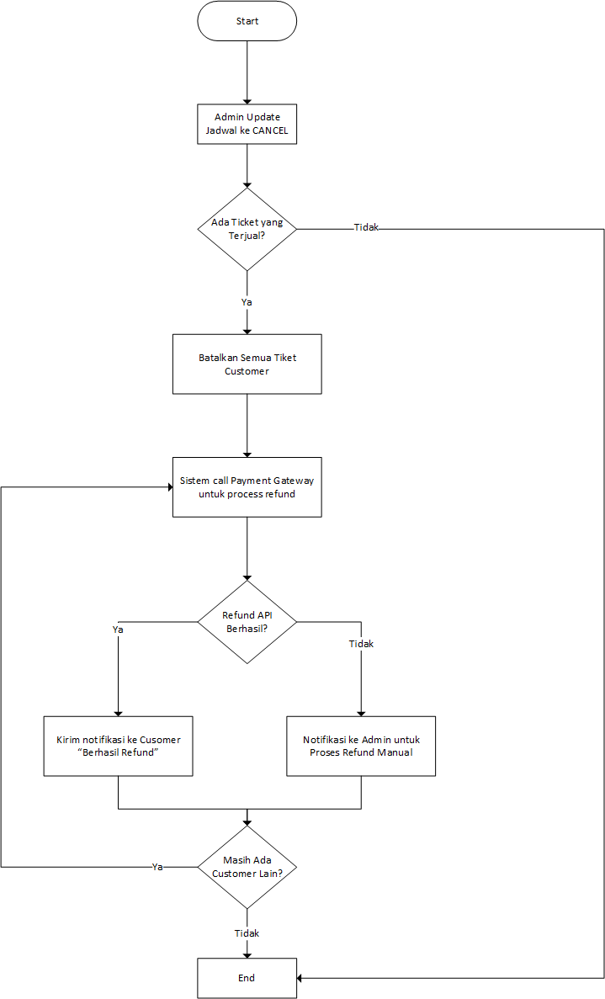

System Design
---

## System Flowcharts

### Flowchart 1: User Journey - Pembelian Tiket

**Penjelasan Langkah-langkah:**

| Langkah | Deskripsi |
|---------|-----------|
| **Mulai** | Pelanggan membuka aplikasi atau website bioskop |
| **Cek Login** | Sistem memeriksa apakah pelanggan sudah login. Jika belum, diarahkan ke halaman login/register |
| **Dashboard** | Pelanggan memilih kota dan bioskop yang diinginkan |
| **Pilih Film** | Pelanggan melihat daftar film yang sedang tayang |
| **Pilih Jadwal Tayang** | Pelanggan memilih tanggal dan waktu tayang yang tersedia |
| **Cek Kursi** | Sistem memeriksa ketersediaan kursi untuk jadwal yang dipilih |
| **Tampilkan Peta Kursi** | Jika kursi tersedia, sistem menampilkan peta kursi real-time dengan status setiap kursi |
| **Pilih Kursi** | Pelanggan memilih kursi yang diinginkan |
| **Lock Kursi 10 Menit** | Sistem mengunci kursi tersebut secara otomatis untuk pelanggan ini selama 10 menit |
| **Detail Booking** | Sistem menampilkan ringkasan pemesanan (film, waktu, kursi, harga) |
| **Proses Payment** | Pelanggan melakukan pembayaran |
| **Pembayaran Berhasil?** | Sistem menunggu konfirmasi pembayaran |
| **Ya - Berhasil** | Status tiket diubah menjadi SOLD (Terjual). E-tiket dikirim ke email pelanggan |
| **Tidak - Gagal/Timeout** | Sistem otomatis membuka kunci kursi. Status kursi kembali menjadi AVAILABLE (Tersedia) |
| **Selesai** | Proses pembelian selesai |
### Flowchart 2: Refund & Pembatalan dari Bioskop

**Penjelasan Langkah-langkah:**

| Langkah | Deskripsi |
|---------|-----------|
| **Mulai** | Admin bioskop membatalkan jadwal tayang tertentu |
| **Update Status Jadwal** | Admin mengubah status jadwal menjadi CANCEL (Dibatalkan) |
| **Cek Tiket Terjual** | Sistem memeriksa apakah ada tiket yang sudah terjual untuk jadwal tersebut |
| **Tidak Ada Tiket** | Jika tidak ada tiket terjual, proses selesai |
| **Ada Tiket Terjual** | Sistem mengidentifikasi semua pelanggan yang sudah membeli tiket |
| **Batalkan Semua Tiket** | Status semua tiket untuk jadwal tersebut diubah menjadi REFUNDED (Dikembalikan) |
| **Proses Refund** | Sistem menghubungi payment gateway untuk memproses pengembalian dana |
| **Refund Berhasil?** | Sistem memeriksa hasil refund dari payment gateway |
| **Ya - Berhasil** | Sistem mengirim notifikasi "Berhasil Refund" ke pelanggan via email |
| **Tidak - Gagal** | Sistem mengirim notifikasi ke admin untuk proses refund manual |
| **Masih Ada Pelanggan Lain?** | Sistem mengecek apakah masih ada pelanggan lain yang perlu di-refund |
| **Ya** | Kembali ke proses refund untuk pelanggan berikutnya |
| **Tidak** | Semua refund selesai diproses |
| **Selesai** | Proses pembatalan dan refund selesai |

---

## Solusi Teknis

## 1. Sistem Pemilihan Tempat Duduk
* Setiap pelanggan mengklik kursi, sistem segera mengubah statusnya di database menjadi Sedang locked.
* Ketika status berubah menjadi LOCKED, maka hanya berlaku selama 10 menit untuk menyelesaikan pembayaran, jika lebih dari 10 menik maka status berubah menjadi AVAILABLE dan pelanggan lain bisa mendapatkan kursi tersetut.
* Optimasi Kecepatan menggunakan Indexing pada kolom kursi dan jadwal tayang.

## 2. Sistem Pencatatan dan Restok Tiket

* Setelah pembayaran sukses, sistem mencatat detail lengkap transaksi (ID Transaksi, Nomor Kursi, ID Pelanggan, Waktu Beli) dan mengubah status kursi menjadi **Terjual** secara permanen.
* Proses pemeriksaan kursi yang tidak dibayarkan berjalan otomatis setiap 1 menit menggunakan cronjob untuk memastikan kursi kosong segera muncul kembali.
* Jika jadwal tayang dibatalkan oleh pihak bioskop, semua kursi yang sudah sold untuk jadwal tersebut otomatis diubah kembali menjadi available.

## 3. Alur Refund dan Pembatalan Bioskop

* Staf admin memilih jadwal tayang dan menekan tombol "Batalkan Tayangan" Status jadwal langsung berubah menjadi cancelled.
* Sistem otomatis mengirim email atau wa kepada semua pelanggan yang sudah membeli tiket untuk jadwal yang dibatalkan.
* Untuk menjaga kecepatan sistem, proses refund tidak dilakukan secara langsung menggunakan RabbitMQ untuk di proses secara asinkron.
* Semua detail dan status dicatat di database. Jika terjadi kegagalan teknis saat pengembalian dana, sistem mencatat error tersebut untuk di-retry dan dimasukkan ke queue lagi ,dan ketika retry mencapai batas maksimal misalnya 5 kali gagal, maka akan dikirim notifikasi ke admin untuk melakukan refund manual.